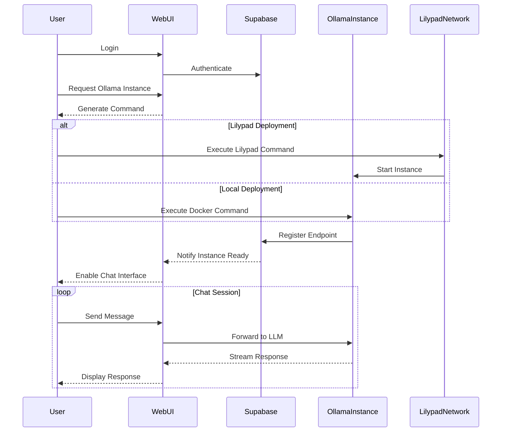

# Ollama Cloudflared WebUI
This WebUI is part a personal Proof of Concept (PoC) project for the Lilypad Network.
The goal of this PoC is to demonstrate the feasibility of using Cloudflared (Quicktunnels) to tunnel traffic from a Lilypad module to a cloud-based service.
In this instance we are requesting on-demand Ollama endpoints on a GPU enabled Lilypad Resource Provider and establish a connection to the Chat WebUI.

## Table of Contents
- [Features](#features)
- [Technologies Used](#technologies-used)
- [Getting Started](#getting-started)
  - [Prerequisites](#prerequisites)
  - [Installation](#installation)
  - [Configuration](#configuration)
  - [Running the Application](#running-the-application)
- [How It Works](#how-it-works)
  - [Instance Request Flow](#instance-request-flow)
  - [Sequence Diagram](#sequence-diagram)
- [Instance Setup](#instance-setup)
  - [Local Docker Setup](#local-docker-setup)
  - [Lilypad Network Setup](#lilypad-network-setup)
- [Project Structure](#project-structure)
- [Contributing](#contributing)
- [License](#license)

## Features
- Real-time chat interface with user and assistant roles
- Authentication using Supabase
- Connection status monitoring
- Settings and configuration management
- Automated Ollama instance provisioning via Lilypad network
- Real-time instance status tracking
- Dynamic endpoint configuration
- Error handling and logging

## Technologies Used
- [React](src/App.tsx)
- [TypeScript](src/types.ts)
- [Express](server.js)
- [Supabase](src/lib/supabase.ts)
- [Vite](vite.config.ts)
- [Tailwind CSS](tailwind.config.js)
- [ESLint](eslint.config.js)

## Getting Started

### Prerequisites
- [Node.js](https://nodejs.org/) v14 or later
- [npm](https://www.npmjs.com/)

### Installation
1. Clone the repository:
   ```bash
   git clone https://github.com/yourusername/ollama-cloudflared-webui.git
   ```
2. Navigate to the project directory:
   ```bash
   cd ollama-cloudflared-webui
   ```
3. Install dependencies:
   ```bash
   npm install
   ```

### Configuration
Rename `.env.example` to `.env.local` and fill in your Supabase credentials:

```bash
VITE_SUPABASE_URL=https://<instance>.supabase.co
VITE_SUPABASE_ANON_KEY=<anon_key>
```

### Running the Application
Start the development server:

```bash
npm run dev
```

The application will be available at `http://localhost:5173`.

## How It Works

### Instance Request Flow
1. User authenticates with the WebUI using Supabase
2. User requests a new Ollama instance through the interface
3. WebUI generates either a Docker command or Lilypad command based on user preferences
4. User executes the command on their machine or Lilypad network
5. The started instance registers itself with Supabase
6. WebUI detects the available endpoint and enables chat functionality

### Sequence Diagram


## Instance Setup

### Local Docker Setup
When using the local Docker setup, the WebUI will generate a command like:
```bash
docker run -d --name ollama-instance \
  -e SUPABASE_URL=<your-supabase-url> \
  -e INSTANCE_ID=<generated-id> \
  ghcr.io/yourusername/ollama-cloudflared:latest
```

### Lilypad Network Setup
For Lilypad network deployment, you'll receive a command like:
```bash
lilypad run \
  --module ollama-cloudflared \
  --env SUPABASE_URL=<your-supabase-url> \
  --env INSTANCE_ID=<generated-id> \
  --gpu 1
```

The instance will automatically:
1. Start the Ollama server
2. Establish a Cloudflare tunnel
3. Register the endpoint in Supabase
4. Begin accepting chat requests

## Project Structure
```
ollama-cloudflared-webui/
├── .env
├── index.html
├── server.js
├── src/
│   ├── App.tsx
│   ├── components/
│   │   ├── Auth.tsx
│   │   ├── Chat/
│   │   │   ├── ChatHeader.tsx
│   │   │   ├── ChatMessages.tsx
│   │   │   └── index.tsx
│   │   ├── ConfirmationModal.tsx
│   │   ├── ConnectionStatus.tsx
│   │   ├── DockerCommandModal.tsx
│   │   ├── ErrorBoundary.tsx
│   │   └── OllamaInstanceRequest.tsx
│   ├── index.css
│   ├── lib/
│   │   ├── endpoint.ts
│   │   ├── store.ts
│   │   ├── supabase.ts
│   │   └── utils.ts
│   ├── main.tsx
│   ├── types.ts
│   └── vite-env.d.ts
├── supabase/
    └── migrations/
        └── 20250117234308_withered_heart.sql
```

## Contributing
Contributions are welcome! Please submit a pull request or open an issue to discuss changes.

## License
This project is licensed under the MIT License.
