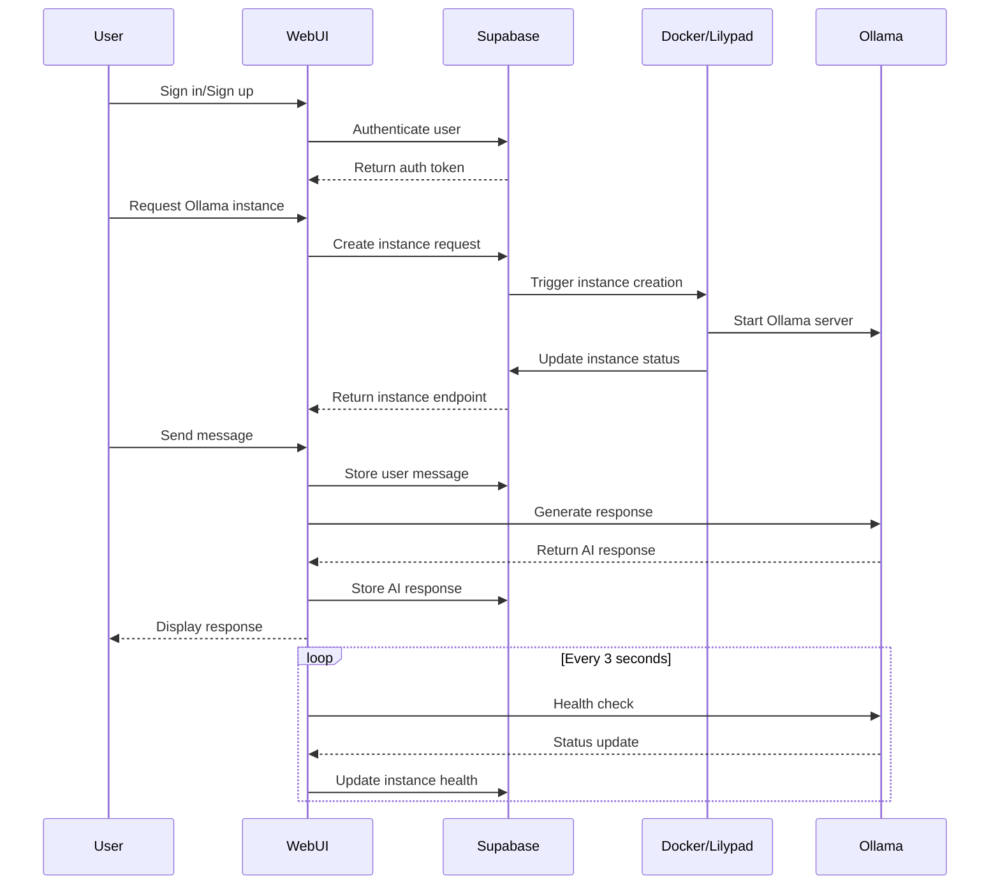

# Lily Chat 🌸

A modern, secure chat application powered by Ollama for local AI model inference. Built with React, TypeScript, and Supabase.

## Features

- 🔒 Secure authentication with email/password
- 🤖 Local AI model integration via Ollama
- 💬 Real-time chat interface with markdown support
- 🔄 Automatic health monitoring of Ollama instances
- 🚀 Docker and Lilypad deployment options
- 🎨 Beautiful, responsive UI with Tailwind CSS
- ⚡ Vite-powered development experience

## Tech Stack

- **Frontend**: React, TypeScript, Tailwind CSS
- **Backend**: Express.js proxy server
- **Database**: Supabase (PostgreSQL)
- **Authentication**: Supabase Auth
- **AI Integration**: Ollama API
- **Icons**: Lucide React
- **Development**: Vite, ESLint

## Getting Started

### Prerequisites

- Node.js 18+
- Supabase account
- Ollama instance (local or remote)

### Environment Setup

Create a `.env` file in the root directory:

```env
VITE_SUPABASE_URL=your_supabase_url
VITE_SUPABASE_ANON_KEY=your_supabase_anon_key
```

### Installation

```bash
# Install dependencies
npm install

# Start the development server
npm run dev
```

## Architecture

### Core Components

1. **Authentication (`Auth.tsx`)**
   - Handles user signup/signin
   - Manages authentication state

2. **Chat Interface (`Chat/`)**
   - `ChatHeader`: Navigation and model selection
   - `ChatInput`: Message input with connection status
   - `ChatMessages`: Message display with markdown support
   - `SettingsModal`: Model and endpoint configuration

3. **Ollama Integration**
   - Instance management
   - Health monitoring
   - Model selection
   - Message generation

### State Management

- Uses Zustand for global state management
- Manages chat messages, Ollama endpoint, and selected model
- Handles error logging and instance status

### Database Schema

1. **Messages**
   - Stores chat history
   - Links messages to users
   - Supports conversation threading

2. **Error Logs**
   - Tracks system errors
   - Helps with debugging and monitoring

3. **Ollama Instances**
   - Manages Ollama instance lifecycle
   - Tracks instance status and endpoints

### Security Features

- Row Level Security (RLS) on all tables
- Authenticated API endpoints
- Secure proxy for Ollama API
- Error handling and sanitization

## Development

### Project Structure

```
src/
├── components/     # React components
├── lib/           # Utilities and store
├── types/         # TypeScript definitions
└── main.tsx       # Application entry
```

### Key Files

- `server.js`: Express proxy server
- `endpoint.ts`: Ollama instance management
- `store.ts`: Global state management
- `types.ts`: TypeScript interfaces

### Running Tests

```bash
npm run test
```

### Building for Production

```bash
npm run build
```

## Deployment

### Docker Deployment

```bash
docker run -d --gpus=all \
  -e SUPABASE_INSTANCE_ID="your_instance_id" \
  -e SUPABASE_URL="your_supabase_url" \
  -e SUPABASE_ANON_KEY="your_anon_key" \
  ghcr.io/rhochmayr/ollama-cloudflared:latest
```

### Lilypad Deployment

```bash
lilypad run --target your_target \
  github.com/rhochmayr/ollama-cloudflared:0.1.0 \
  -i SUPABASE_INSTANCE_ID="your_instance_id" \
  -i SUPABASE_URL="your_supabase_url" \
  -i SUPABASE_ANON_KEY="your_anon_key"
```

## Contributing

1. Fork the repository
2. Create a feature branch
3. Commit your changes
4. Push to the branch
5. Open a Pull Request

## License

MIT License - feel free to use this project for your own purposes.

## Acknowledgments

- Built with [Vite](https://vitejs.dev/)
- UI components powered by [Tailwind CSS](https://tailwindcss.com/)
- Icons from [Lucide](https://lucide.dev/)
- Database and auth by [Supabase](https://supabase.com/)
- AI capabilities by [Ollama](https://ollama.ai/)

## System Flow



The diagram above shows the main interaction flows in the system:

1. **Authentication**: User authentication through Supabase
2. **Instance Creation**: Ollama instance deployment via Docker or Lilypad
3. **Chat Flow**: Message handling and AI response generation
4. **Health Monitoring**: Continuous instance health checking